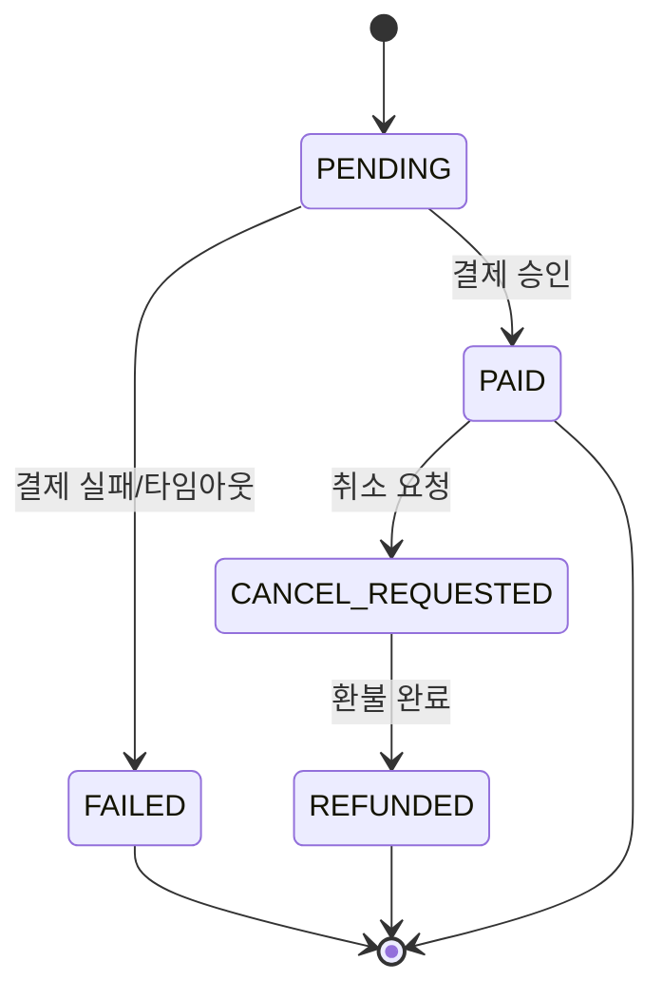
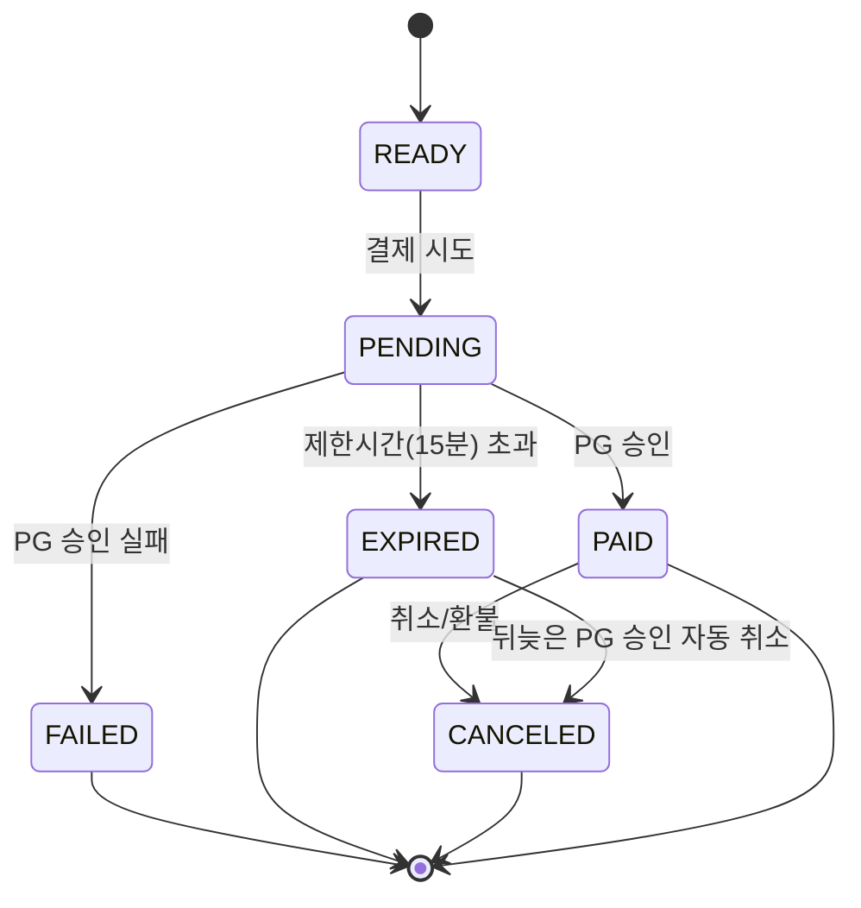
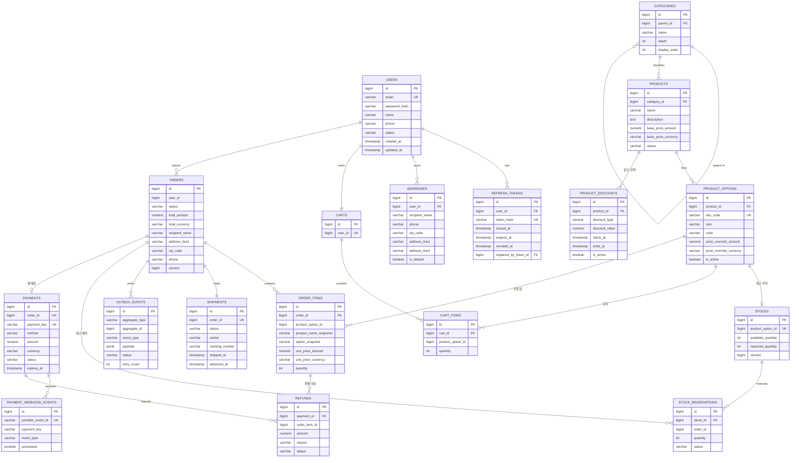

# lee-commerce

주문 생성부터 결제 승인, 취소/환불까지 — 재고 동시성과 외부 PG 연동의 정합성을 직접 다루는
단일 판매자 커머스 백엔드. DDD 기반 모듈러 모놀리스로 Bounded Context 경계를 Gradle 모듈과
ArchUnit으로 강제한다. 프론트엔드는 다루지 않는다(API + Swagger로 대체).

## 무엇을 다루는가

- 회원가입/로그인 → 장바구니 → 주문 → 결제(토스페이먼츠) → 취소/환불로 이어지는 전체 흐름
- 동시 주문 상황에서 재고가 오버셀되지 않도록 낙관적 락 / 비관적 락 / Redis 분산락 세 가지 전략 비교
- 결제 승인과 재고 예약 만료가 동시에 발생하는 레이스컨디션 처리
- Outbox 패턴 기반 비동기 이벤트 발행(Kafka), 검색 인덱스(Elasticsearch) 동기화

## 기술 스택

- Java 25 (LTS)
- Spring Boot 4.1
- PostgreSQL 18 (Bounded Context별 스키마 분리)
- Kafka 4.1 (Outbox 이벤트 발행)
- Redis + Redisson 4.7 (재고 분산락 + 디바이스별 세션 관리)
- Elasticsearch + Spring Data Elasticsearch 6.0 (상품 검색 전용 읽기 인덱스, Outbox 기반 동기화)
- 토스페이먼츠 (결제, 테스트모드 연동)
- JUnit5 5.14, Mockito 5.23, Testcontainers 2.0, ArchUnit 1.4
- Docker Compose (로컬 개발)
- springdoc-openapi 2.8 (Swagger/OpenAPI)

## 핵심 유저 플로우

```
장바구니(일부 선택 가능) → 주문서 작성(주소록 선택 또는 신규 입력)
   → 주문 생성 [PENDING] + 재고 "예약" (동시성 제어)
   → 토스페이먼츠 결제창 호출 (제한시간 15분)
   → 결제 승인 콜백/webhook 검증 (멱등성 보장)
   → 성공: 재고 확정 차감, 주문 [PAID]
   → 실패/타임아웃: 재고 예약 해제, 주문 [FAILED]
   → 배송준비 → 배송중 → 배송완료
   → (배송 시작 전까지) 취소 요청 → 환불(부분환불 포함)
```

### 주문 상태 머신



### 결제 상태 머신



## 도메인 (Bounded Context)

| Context | 책임 |
|---|---|
| `user` | 회원가입/로그인, JWT+Redis 디바이스별 세션, 배송지 주소록 |
| `catalog` | 상품/카테고리/옵션(SKU)/할인 정책, 검색(Elasticsearch) |
| `inventory` | 재고, 재고 예약(동시성 제어 3전략 비교) |
| `cart` | 장바구니 |
| `order` | 주문, 배송(Shipment) |
| `payment` | 결제(토스페이먼츠), 환불 |

각 컨텍스트의 불변식/정책은 Obsidian `domain/{context}.md`에서 관리한다(이 repo 밖, 개인 vault).

## ERD



PK/UK/FK가 안 붙은 참조 필드(`orders.user_id`, `stocks.product_option_id` 등)는 스키마 경계를 넘는
논리적 참조다 — 물리적 FK가 없고, mermaid 문법상 시각적으로도 구분되지 않는다. 실제 DDL은
[`db/schema.sql`](./db/schema.sql) 참고.

## 프로젝트 구조

```
.
└── db/schema.sql        PostgreSQL DDL (스키마별)
```
